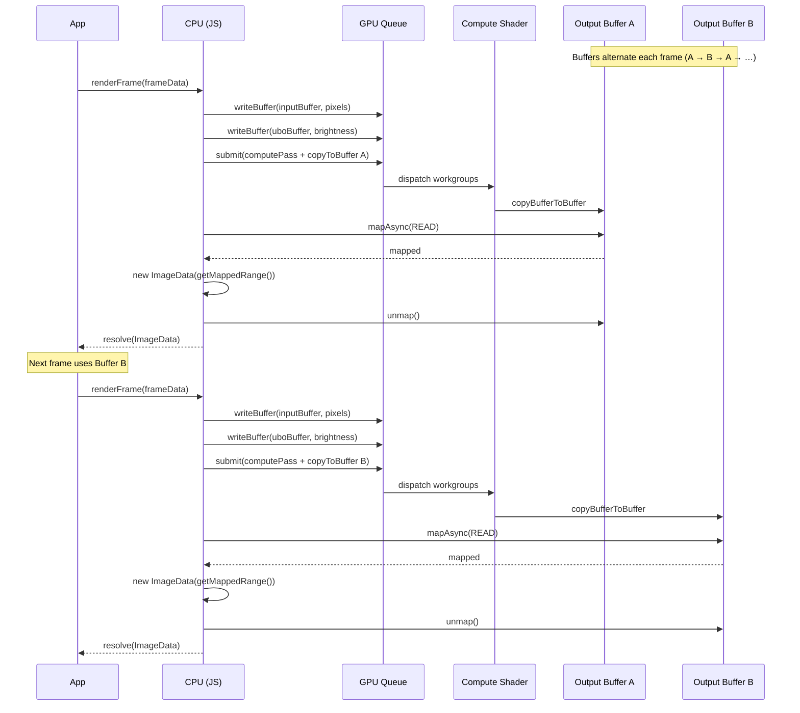
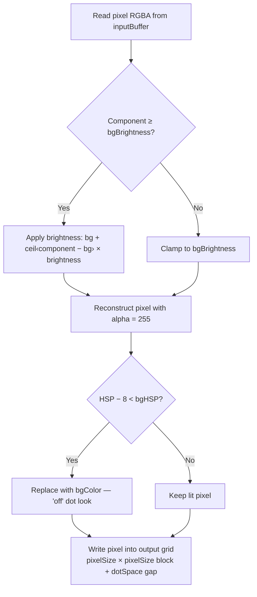
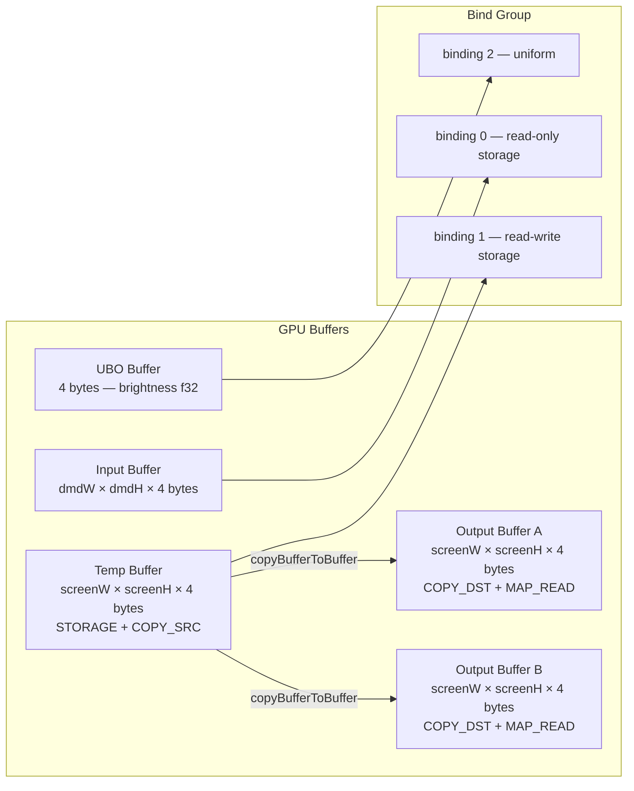

# DmdRenderer — Rendering Pipeline

## Per-Frame Flow (Double-Buffered)

```mermaid
sequenceDiagram
    participant App
    participant CPU as CPU (JS)
    participant Queue as GPU Queue
    participant Compute as Compute Shader
    participant BufA as Output Buffer A
    participant BufB as Output Buffer B

    Note over BufA,BufB: Buffers alternate each frame (A → B → A → …)

    App->>CPU: renderFrame(frameData)
    CPU->>Queue: writeBuffer(inputBuffer, pixels)
    CPU->>Queue: writeBuffer(uboBuffer, brightness)
    CPU->>Queue: submit(computePass + copyToBuffer A)
    Queue->>Compute: dispatch workgroups
    Compute->>BufA: copyBufferToBuffer
    CPU->>BufA: mapAsync(READ)
    BufA-->>CPU: mapped
    CPU->>CPU: new ImageData(getMappedRange())
    CPU->>BufA: unmap()
    CPU-->>App: resolve(ImageData)

    Note over App: Next frame uses Buffer B

    App->>CPU: renderFrame(frameData)
    CPU->>Queue: writeBuffer(inputBuffer, pixels)
    CPU->>Queue: writeBuffer(uboBuffer, brightness)
    CPU->>Queue: submit(computePass + copyToBuffer B)
    Queue->>Compute: dispatch workgroups
    Compute->>BufB: copyBufferToBuffer
    CPU->>BufB: mapAsync(READ)
    BufB-->>CPU: mapped
    CPU->>CPU: new ImageData(getMappedRange())
    CPU->>BufB: unmap()
    CPU-->>App: resolve(ImageData)
```

## Compute Shader Logic

```mermaid
flowchart TD
    A[Read pixel RGBA from inputBuffer] --> B{Component ≥ bgBrightness?}
    B -- Yes --> C[Apply brightness: bg + ceil‹component − bg› × brightness]
    B -- No --> D[Clamp to bgBrightness]
    C --> E[Reconstruct pixel with alpha = 255]
    D --> E
    E --> F{HSP − 8 < bgHSP?}
    F -- Yes --> G[Replace with bgColor — 'off' dot look]
    F -- No --> H[Keep lit pixel]
    G --> I[Write pixel into output grid<br>pixelSize × pixelSize block + dotSpace gap]
    H --> I
```

## Resource Layout

```mermaid
graph LR
    subgraph GPU Buffers
        UBO[UBO Buffer<br>4 bytes — brightness f32]
        IN[Input Buffer<br>dmdW × dmdH × 4 bytes]
        TEMP[Temp Buffer<br>screenW × screenH × 4 bytes<br>STORAGE + COPY_SRC]
        OUT_A[Output Buffer A<br>screenW × screenH × 4 bytes<br>COPY_DST + MAP_READ]
        OUT_B[Output Buffer B<br>screenW × screenH × 4 bytes<br>COPY_DST + MAP_READ]
    end

    subgraph Bind Group
        B0[binding 0 — read-only storage]
        B1[binding 1 — read-write storage]
        B2[binding 2 — uniform]
    end

    IN --> B0
    TEMP --> B1
    UBO --> B2

    TEMP -->|copyBufferToBuffer| OUT_A
    TEMP -->|copyBufferToBuffer| OUT_B
```
