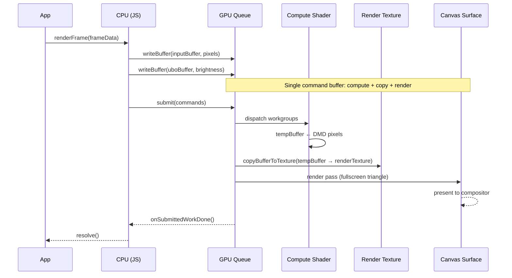
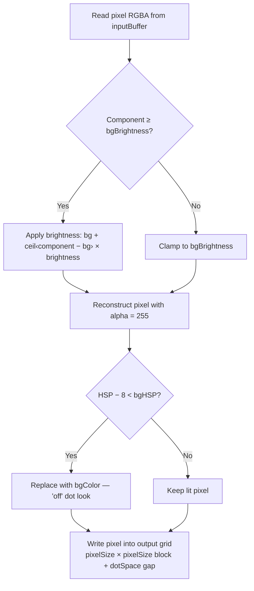
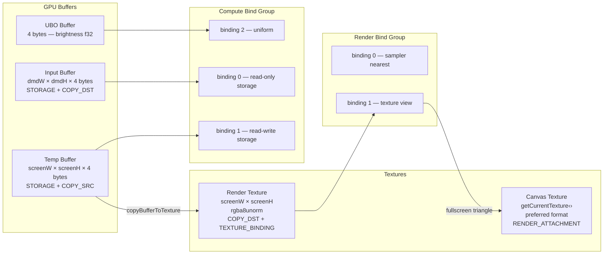
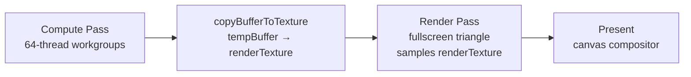

# DmdRenderer — Rendering Pipeline

## Per-Frame Flow (Zero Readback — Render-to-Texture)

```mermaid
sequenceDiagram
    participant App
    participant CPU as CPU (JS)
    participant Queue as GPU Queue
    participant Compute as Compute Shader
    participant Tex as Render Texture
    participant Canvas as Canvas Surface

    App->>CPU: renderFrame(frameData)
    CPU->>Queue: writeBuffer(inputBuffer, pixels)
    CPU->>Queue: writeBuffer(uboBuffer, brightness)

    Note over Queue,Canvas: Single command buffer: compute + copy + render

    CPU->>Queue: submit(commands)
    Queue->>Compute: dispatch workgroups
    Compute->>Compute: tempBuffer ← DMD pixels
    Queue->>Tex: copyBufferToTexture(tempBuffer → renderTexture)
    Queue->>Canvas: render pass (fullscreen triangle)
    Canvas-->>Canvas: present to compositor

    Queue-->>CPU: onSubmittedWorkDone()
    CPU-->>App: resolve()
```

## Compute Shader Logic

```mermaid
flowchart TD
    A[Read pixel RGBA from inputBuffer] --> B{Component ≥ bgBrightness?}
    B -- Yes --> C[Apply brightness: bg + ceil‹component − bg› × brightness]
    B -- No --> D[Clamp to bgBrightness]
    C --> E[Reconstruct pixel with alpha = 255]
    D --> E
    E --> F{HSP − 8 < bgHSP?}
    F -- Yes --> G[Replace with bgColor — 'off' dot look]
    F -- No --> H[Keep lit pixel]
    G --> I[Write pixel into output grid<br>pixelSize × pixelSize block + dotSpace gap]
    H --> I
```

## Resource Layout

```mermaid
graph LR
    subgraph GPU Buffers
        UBO[UBO Buffer<br>4 bytes — brightness f32]
        IN[Input Buffer<br>dmdW × dmdH × 4 bytes<br>STORAGE + COPY_DST]
        TEMP[Temp Buffer<br>screenW × screenH × 4 bytes<br>STORAGE + COPY_SRC]
    end

    subgraph Textures
        RT[Render Texture<br>screenW × screenH<br>rgba8unorm<br>COPY_DST + TEXTURE_BINDING]
        CT[Canvas Texture<br>getCurrentTexture‹›<br>preferred format<br>RENDER_ATTACHMENT]
    end

    subgraph Compute Bind Group
        B0[binding 0 — read-only storage]
        B1[binding 1 — read-write storage]
        B2[binding 2 — uniform]
    end

    subgraph Render Bind Group
        R0[binding 0 — sampler nearest]
        R1[binding 1 — texture view]
    end

    IN --> B0
    TEMP --> B1
    UBO --> B2

    TEMP -->|copyBufferToTexture| RT
    RT --> R1
    R1 -->|fullscreen triangle| CT
```

## Pipeline Stages (single command encoder per frame)

```mermaid
flowchart LR
    A[Compute Pass<br>64-thread workgroups] --> B[copyBufferToTexture<br>tempBuffer → renderTexture]
    B --> C[Render Pass<br>fullscreen triangle<br>samples renderTexture]
    C --> D[Present<br>canvas compositor]
```
